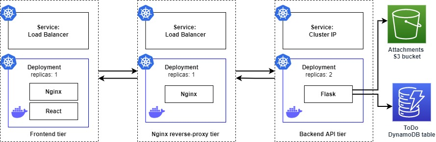

# Full-Stack TODO App in EKS

Full-Stack ToDo application hosted on AWS using Amazon EKS with React Frontend and Nginx reverse-proxy and Flask backend services

### Functionality
- This application allows performing CRUD operations on Todo items stored on AWS DynamoDB.
- Each Todo item can optionally have an attachment image stored on Amazon S3.
- Each user ONLY has access to Todo items that they created. Users authenticated and issued a RS256 signed JWT tokens by Auth0 verified using Auth0 JWKS endpoint.

## Architecture



<!-- ## Stack

- Frontend
    - ReactJS
    - served by NginX

- Backend
    - NginX reverse proxy
    - Flask
    - authentication

Kubernetes (EKS)
- helm
- Healthcheck
- HPA
- Cluster Autoscaller -->

## Running

### __Pre-requisite__
1. __Database(DynamoDB):__ Create the `Todos-{env}` table on Amazon DynamoDB. The database is used to store the Todo items data.
2. __Filestore(S3):__ Create the AWS S3 `attachments` bucket. The S3 bucket is used to store Todo items attachment image

## I. Run locally with `docker-compose`

__Building Images__

```
docker-compose build
```

__Running Images__

```
docker-compose up
```

##  II. Run in production with `Kubernetes`

### __Pre-requisite__
1. __eksctl:__ Install eksctl for creating the cluster on EKS
2. __helm:__ Install helm to deploy assests on the EKS cluster

### __Create EKS Cluster with eksctl:__ 
Create an EKS Cluster on AWS with worker-nodes to run the pods

```bash
eksctl create cluster -f cluster.yaml
```

### __Install the Helm Chart__
Install the helm chart to deploy the application on the EKS cluster

```bash
helm install todo-app ./charts/todo-app
```